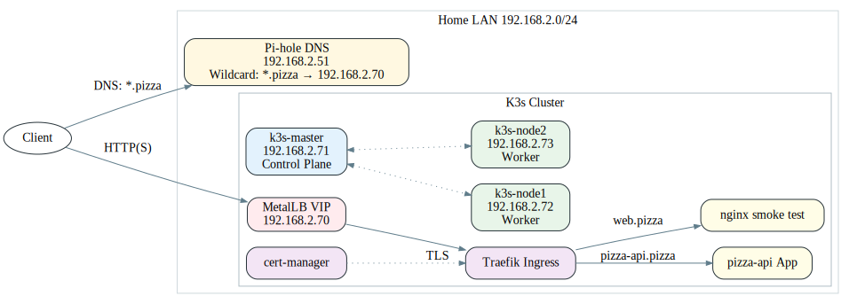

# DeepDish Cluster (Debian 13)

A Chicago-style, pizza-themed **K3s cluster** on Debian 13 VMs, topped with **MetalLB**, **Traefik**, and **cert-manager**.  

## Architecture


## Quick Start
1) Prepare nodes (hostnames/IPs/sudo/SSH).
2) Install master:
```bash
k3s/install-master.sh
```
3) Join workers:
```bash
k3s/join-worker.sh <MASTER_IP> <TOKEN_FILE|TOKEN_STRING>
```
4) Add-ons:
```bash
kubectl apply -f cluster/metallb/ip-pool.yaml
kubectl apply -f cluster/cert-manager/cluster-issuer-selfsigned.yaml
```
5) Diagram:
```bash
make diagram
```

## Layout
- `config/` — chrony, unattended-upgrades, Pi-hole examples  
- `scripts/` — setup, trim services, health checks  
- `k3s/` — install/join scripts  
- `cluster/` — MetalLB, cert-manager, Traefik bits  
- `apps/` — nginx smoke, pizza-api  
- `docs/` — Graphviz sources + rendered PNG/SVG  
