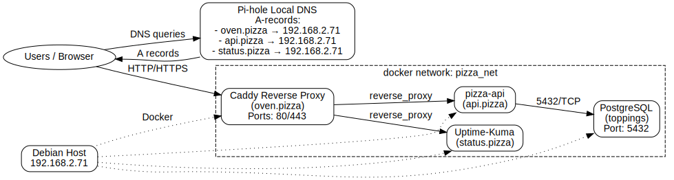

# 🍕 DeepDish Cluster (Debian 13)

A Chicago-style, pizza-themed **K3s** cluster on **Debian 13** — using Terraform to provision, configure, and pull back a ready-to-use `kubeconfig`.  
K3s ships with **Traefik** as the ingress controller. **MetalLB** will be added in a future revision (not included yet).  
(Optional next step: add **cert-manager** for automated TLS.)

---

## 🧩 Components

- **Oven** → [Caddy](https://caddyserver.com/) reverse proxy → `oven.pizza`
- **API** → sample service → `api.pizza`
- **Status** → [Uptime-Kuma](https://github.com/louislam/uptime-kuma) → `status.pizza`
- **DB** → PostgreSQL (codename: `toppings`)

---

## 🚀 Quickstart

1. In **Pi-hole Local DNS**, add A-records:
   - `oven.pizza` → `192.168.2.71`
   - `api.pizza` → `192.168.2.71`
   - `status.pizza` → `192.168.2.71`

2. Ensure Docker is installed and your user is in the `docker` group.

3. Provision with Terraform:
   ```bash
   make init
   make apply
Visit:

http://oven.pizza

http://api.pizza

http://status.pizza

⚠️ Ports & Conflicts
This stack binds 80/443 for Caddy.
If another proxy (e.g., Traefik) is already listening, either:

Change caddy_http_port / caddy_https_port in infra/envs/homelab/variables.tf, or

Remove the Caddy container and route api.pizza + status.pizza through your existing proxy.

Check usage:

bash
Copy code
sudo ss -tulpn | grep -E ':(80|443)\b' || true
docker ps --format 'table {{.Names}}\t{{.Ports}}'

## Architecture



Render the diagram (requires [Graphviz](https://graphviz.org/)):

```bash
make diagram
Outputs:

docs/architecture.svg (ideal for GitHub README)

docs/architecture.png (handy for docs/slides)


🧹 Teardown
bash
Copy code
make destroy
📌 Why it matters
This project demonstrates:

Infrastructure as Code with Terraform (no manual docker run)

Reverse proxy + service composition with Docker

Monitoring integration using Uptime-Kuma

Local DNS integration with Pi-hole

Clean developer workflow via make targets:

make init → initialize Terraform

make apply → bring up the stack

make diagram → regenerate architecture diagrams

make destroy → tear everything down
